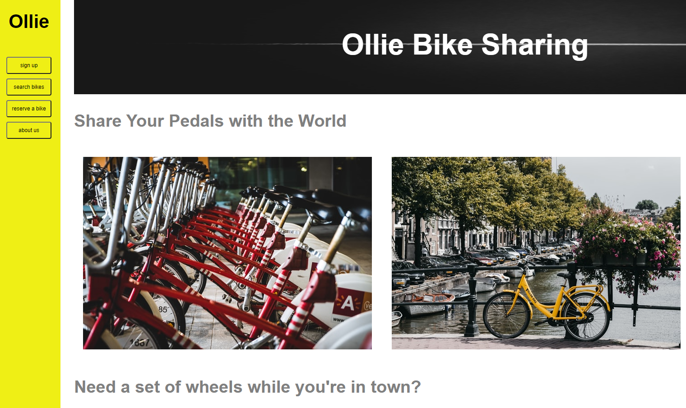
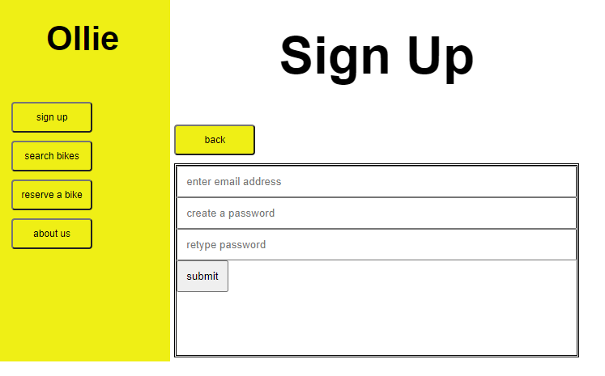

Client - Ollie Bike Sharing
---------------------------
Took  a 1page bare-bones CodeCademy website. Their lesson included a nav bar, headings, a picture and a video - made it into a better version & more interactive.
---
Overview
---------
*Turn this 1 page lesson into an entire app for push bike sharing co. 
*Make it responsive for phones, tablets, desktop devices.
*Improve landing page - add responsive buttons and extra styling.
*Link buttons on nav to actual pages with appropriate form, styling, reservation data to book a bike.v
*Tell customers about the service and of course entice them to book or sign up to newsletters and promos.

Job outline
-----------
- menu bar with buttons to direct to alt pages
- wrap it in a container - use flexbox for styling
- header banner with logo pic
- include brand video on main page
- add a useful scroll to top button
- in this example forms are not linked to a server but inputs work and refresh after leaving the page.

take-outs
---------
Changed photos and created a landing page with extra info. It links to 3 sub pages used Vue which is a clean, easy and super lightweight method with only a few lines of code (see snippet below) for this job to manipulate pages making them interactive. For pages 2 and 4, used css styling to create basic forms which depending on useage requirements can easily be pimped up.

Vue Code Snippet
----------------
```javascript
var app = new Vue({
    el: '#app',
    data: VueData,
    methods: {
        changePage: function (name) {
            this.page = name;
        }
    }
})

function VueData(){
    return {
       page: 'main'
    };
}
```
Ollie Bike Sharing Landing Page snippet
---------------------------------------




Part of page 2
--------------

